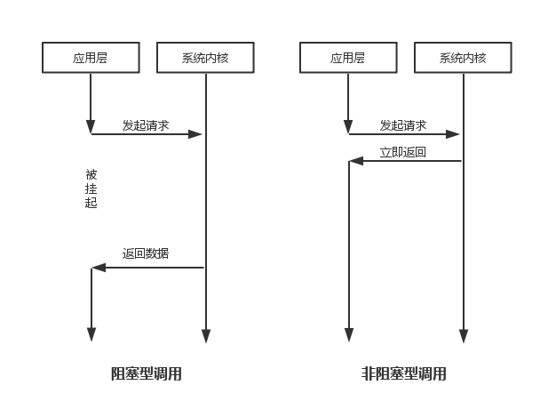
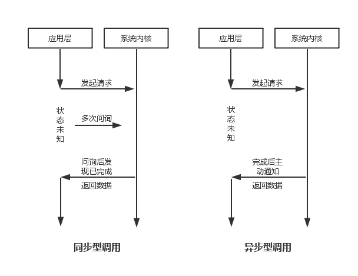
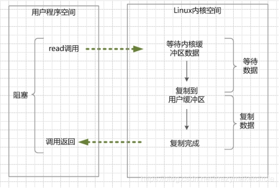
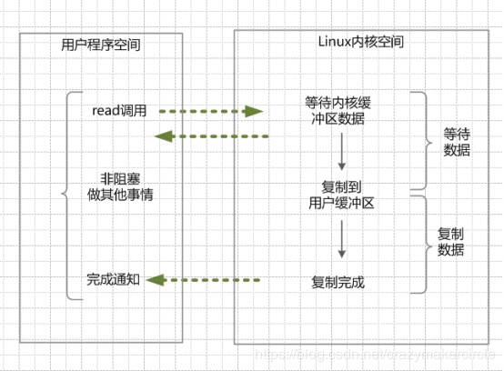

# 1.基本概念
在Java网络通信中，最基本的概念就是Socket编程了。Socket又称“套接字” 向网络发出请求或者应答网络请求。

Socket 和ServerSocket类库位于 Java.net 包中。ServerSocket用于服务器端，Socket是建立网络连接时使用的。在连接成功时，应用程序两端都会产生一个Scoket实例，操作这个实例，完成所需要的会话。对于一个网络连接来说，套接字是平等的，不因为在服务器端或者在客户端而产生不同的级别。不管是Socket还是ServerSocket他们的工作都是通过SocketImpl类及其子类完成的。

套接字之间的连接过程可以分为四个步骤：服务器监听，客户端请求服务器，服务器确认，客户端确认，进行通信。

1）服务器监听：是服务器套接字并不定位具体的客户端套接字，而是处于等待连接的状态，实时监控网络状态。

2）服务器请求：是指由客户端的套接字提出连接请求，要连接的目标是服务器端的套接字。为此，客户端的套接字必须首先描叙它要连接的服务器的套接字，指出服务器的套接字的地址和端口，然后就像服务器套接字提出连接请求。

3）服务器连接确认：是指当服务器套接字监听到或者说接收到客户端套接字的连接请求，它就响应客户端套接字的请求，建立一个新的线程，把服务器端的套接字的描述发送给客户端。

4）客户端连接确认：一旦客户端确认了此描叙，连接就建立完成了，双方开始通信。而服务器套接字继续处于监听状态；继续接受其他网络套接字的连接请求。

# 2. Java阻塞和非阻塞以及同步和异步
在Java网络编程中，我们经常会遇到阻塞和非阻塞以及同步和异步的问题：

总结来说，是否是阻塞还是非阻塞，关注的是接口调用（发出请求）后等待数据返回时的状态。被挂起无法执行其他操作的则是阻塞型的，可以被立即「抽离」去完成其他「任务」的则是非阻塞型的。



总结的来说，是否同步还是异步，关注的时应用层是否需要自己去向系统内核问询以及任务完成时，消息通知的方式。对于同步模式来说，应用层需要不断向操作系统内核询问数据是否读取完毕，当数据读取完毕，那此时系统内核将数据返回给应用层，应用层即可以用取得的数据做其他相关的事情。对于异步模式来说，应用层无需主动向系统内核问询，在系统内核读取完文件数据之后，会主动通知应用层数据已经读取完毕，此时应用层即可以接收系统内核返回过来的数据，再做其他事情。



* BIO：同步/阻塞IO
* NIO：同步/非阻塞IO
* AIO：异步/非阻塞IO

# 3. BIO编程


> 1. 当用户线程调用了read系统调用，内核（kernel）就开始了IO的第一个阶段：准备数据。很多时候，数据在一开始还没有到达（比如，还没有收到一个完整的Socket数据包），这个时候kernel就要等待足够的数据到来。
> 2. 当kernel一直等到数据准备好了，它就会将数据从kernel内核缓冲区，拷贝到用户缓冲区（用户内存），然后kernel返回结果。
> 3. 从开始IO读的read系统调用开始，用户线程就进入阻塞状态。一直到kernel返回结果后，用户线程才解除block的状态，重新运行起来。
> 
## 3.1 传统的BIO模式
网络编程的基本模式是Client/Server模型，也就是两个进程直接进行相互通信，其中服务端提供配置信息（绑定IP地址和监听端口），客户端通过连接操作向服务器端监听的地址发起连接请求，通过三次握手建立连接，如果来连接成功，则双方可以进行通信（网络Socket）连接。

简单的描述一下BIO的服务端通信模型：采用BIO通信模型的服务端，通常由一个独立的Acceptor线程负责监听客户端的连接，它接收到客户端连接请求之后为每个客户端创建一个新的线程进行链路处理没处理完成后，通过输出流返回应答给客户端，线程销毁。即典型的一请求一应答通信模型。

传统BIO通信模型图：


同步阻塞式I/O创建的Server源码：
``` java
public class Client {
    public static final String host="localhost";
    public static final int port=8999;

    public static void main(String[] args) throws IOException {
        Socket socket=new Socket(host,port);
        BufferedReader bufferedReader;
        BufferedWriter bufferedWriter;
        try {
            bufferedReader =new BufferedReader(new InputStreamReader(socket.getInputStream()));
            bufferedWriter=new BufferedWriter(new OutputStreamWriter(socket.getOutputStream()));

            bufferedWriter.write("hello服务器!!!!");
            bufferedWriter.newLine();
            bufferedWriter.flush();

            String line = bufferedReader.readLine();
            System.out.println(Thread.currentThread().getName()+" 从客户端收到内容: "+line);
        } catch (IOException e) {
            e.printStackTrace();
        } finally {
            socket.close();
        }
    }
}

public class Server {
    public static int port=8999;

    public static void main(String[] args) throws IOException {
        ServerSocket serverSocket=new ServerSocket(port);
        Socket socket = serverSocket.accept();

        BufferedReader bufferedReader;
         BufferedWriter bufferedWriter;
        try {
            bufferedReader =new BufferedReader(new InputStreamReader(socket.getInputStream()));
            bufferedWriter=new BufferedWriter(new OutputStreamWriter(socket.getOutputStream()));
            String line = bufferedReader.readLine();
            System.out.println(Thread.currentThread().getName()+" 从客户端收到内容: "+line);

            bufferedWriter.write("服务器端传来相应");
            bufferedWriter.newLine();
            bufferedWriter.flush();
        } catch (IOException e) {
            e.printStackTrace();
        } finally {
            try {
                socket.close();
            } catch (IOException e) {
                e.printStackTrace();
            }
        }
    }
}

```
## 3.2 伪异步I/O编程
为了改进这种一连接一线程的模型，我们可以使用线程池来管理这些线程（需要了解更多请参考前面提供的文章），实现1个或多个线程处理N个客户端的模型（但是底层还是使用的同步阻塞I/O），通常被称为“伪异步I/O模型“。采用线程池和任务队列可以实现一种伪异步IO通信框架。将客户端的Socket请求封装成一个task任务（实现Runnable类）然后投递到线程池中去，配置相应的队列实现。

伪异步I/O模型图：


实现很简单，我们只需要将新建线程的地方，交给线程池管理即可，只需要改动刚刚的Server代码即可,并且加入ServerHandler类：
``` java
public class Client {
    public static final String host="localhost";
    public static final int port=8999;

    public static void main(String[] args) throws IOException {
        Socket socket=new Socket(host,port);
        BufferedReader bufferedReader;
        BufferedWriter bufferedWriter;
        try {
            bufferedReader =new BufferedReader(new InputStreamReader(socket.getInputStream()));
            bufferedWriter=new BufferedWriter(new OutputStreamWriter(socket.getOutputStream()));

            bufferedWriter.write("hello服务器!!!!");
            bufferedWriter.newLine();
            bufferedWriter.flush();

            String line = bufferedReader.readLine();
            System.out.println(Thread.currentThread().getName()+" 从客户端收到内容: "+line);
        } catch (IOException e) {
            e.printStackTrace();
        } finally {
            socket.close();
        }
    }
}

public class Server {
    public static int prot=8999;

    public static void main(String[] args) throws IOException {
        ServerSocket serverSocket=new ServerSocket(prot);
        ExecutorService service= Executors.newCachedThreadPool();

        try {
            while (true){
                Socket socket = serverSocket.accept();
                service.execute(new ServerHandler(socket));
            }
        } catch (IOException e) {
            e.printStackTrace();
        } finally {
            serverSocket.close();
        }
    }
}

public class ServerHandler implements Runnable{

    private Socket socket;
    private BufferedReader bufferedReader;
    private BufferedWriter bufferedWriter;

    public ServerHandler(Socket socket) {
        this.socket = socket;
    }

    @Override
    public void run() {
        try {
            bufferedReader =new BufferedReader(new InputStreamReader(socket.getInputStream()));
            bufferedWriter=new BufferedWriter(new OutputStreamWriter(socket.getOutputStream()));
            String line = bufferedReader.readLine();
            System.out.println(Thread.currentThread().getName()+" 从客户端收到内容: "+line);

            bufferedWriter.write("服务器端传来相应");
            bufferedWriter.newLine();
            bufferedWriter.flush();
        } catch (IOException e) {
            e.printStackTrace();
        } finally {
            try {
                socket.close();
            } catch (IOException e) {
                e.printStackTrace();
            }
        }
    }
}

```

我们知道，如果使用CachedThreadPool线程池（不限制线程数量，如果不清楚请参考文首提供的文章），其实除了能自动帮我们管理线程（复用），看起来也就像是1:1的客户端：线程数模型，而使用FixedThreadPool我们就有效的控制了线程的最大数量，保证了系统有限的资源的控制，实现了N:M的伪异步I/O模型。

但是，正因为限制了线程数量，如果发生大量并发请求，超过最大数量的线程就只能等待，直到线程池中的有空闲的线程可以被复用。而对Socket的输入流就行读取时，会一直阻塞，直到发生：
> * 有数据可读
> * 可用数据以及读取完毕
> * 发生空指针或I/O异常

所以在读取数据较慢时（比如数据量大、网络传输慢等），大量并发的情况下，其他接入的消息，只能一直等待，这就是最大的弊端。这就是阻塞IO存在的弊端，下面NIO将会解决这个问题。

## 4. NIO 编程
JDK 1.4中的java.nio.*包中引入新的Java I/O库，其目的是提高速度。实际上，“旧”的I/O包已经使用NIO重新实现过，即使我们不显式的使用NIO编程，也能从中受益。速度的提高在文件I/O和网络I/O中都可能会发生，但本文只讨论后者。


在这种模式中，首先不是进行read系统调动，而是进行select/epoll系统调用。当然，这里有一个前提，需要将目标网络连接，提前注册到select/epoll的可查询socket列表中。然后，才可以开启整个的IO多路复用模型的读流程。

> 1. 进行select/epoll系统调用，查询可以读的连接。kernel会查询所有select的可查询socket列表，当任何一个socket中的数据准备好了，select就会返回。当用户进程调用了select，那么整个线程会被block（阻塞掉）。
> 2. 用户线程获得了目标连接后，发起read系统调用，用户线程阻塞。内核开始复制数据。它就会将数据从kernel内核缓冲区，拷贝到用户缓冲区（用户内存），然后kernel返回结果。
> 3. 用户线程才解除block的状态，用户线程终于真正读取到数据，继续执行。

## 4.1 简介
NIO我们一般认为是New I/O（也是官方的叫法），因为它是相对于老的I/O类库新增的（其实在JDK 1.4中就已经被引入了，但这个名词还会继续用很久，即使它们在现在看来已经是“旧”的了，所以也提示我们在命名时，需要好好考虑），做了很大的改变。但民间跟多人称之为Non-block I/O，即非阻塞I/O，因为这样叫，更能体现它的特点。而下文中的NIO，不是指整个新的I/O库，而是非阻塞I/O。

NIO提供了与传统BIO模型中的Socket和ServerSocket相对应的SocketChannel和ServerSocketChannel两种不同的套接字通道实现。新增的着两种通道都支持阻塞和非阻塞两种模式。

阻塞模式使用就像传统中的支持一样，比较简单，但是性能和可靠性都不好；非阻塞模式正好与之相反。

对于低负载、低并发的应用程序，可以使用同步阻塞I/O来提升开发速率和更好的维护性；对于高负载、高并发的（网络）应用，应使用NIO的非阻塞模式来开发。

## 4.2 缓冲区Buffer
Buffer是一个对象，包含一些要写入或者读出的数据。在NIO库中，所有数据都是用缓冲区处理的。在读取数据时，它是直接读到缓冲区中的；在写入数据时，也是写入到缓冲区中。任何时候访问NIO中的数据，都是通过缓冲区进行操作。

缓冲区实际上是一个数组，并提供了对数据结构化访问以及维护读写位置等信息。

具体的缓存区有这些：ByteBuffe、CharBuffer、 ShortBuffer、IntBuffer、LongBuffer、FloatBuffer、DoubleBuffer。他们实现了相同的接口：Buffer。

## 4.3 通道 Channel
我们对数据的读取和写入要通过Channel，它就像水管一样，是一个通道。通道不同于流的地方就是通道是双向的，可以用于读、写和同时读写操作。底层的操作系统的通道一般都是全双工的，所以全双工的Channel比流能更好的映射底层操作系统的API。网络数据通过Channel读取和写入，通道与流不同之处在于通道时**双向的**，而流只在一个方向移动（一个流必须时InputStream和OutputStream的子类），而通道可以用于读、写或者两者同时进行，最关键的时可以与多路复用器结合起来，有多种的状态位，方便多路复用器去识别。

Channel主要分两大类：
> 1. SelectableChannel:用于网络读写的Channel
> 2. FileChannel：用于文件操作的Channel

我们一般使用的SocketChannle和ServerSocketChannle一般都是SelectableChannel，用于网络读写的Channel.

## 4.4 多路复用器 Selector


Selector是Java  NIO 编程的基础。 Selector提供选择已经就绪的任务的能力：Selector会不断轮询注册在其上的Channel，如果某个Channel上面发生读或者写事件，这个Channel就处于就绪状态，会被Selector轮询出来，然后通过SelectionKey可以获取就绪Channel的集合，进行后续的I/O操作。

Selector就类似于一个管理者（Master）,管理了成千上万个管道，然后轮询哪个管道的数据已经准备好，通知CPU执行IO的数据或者写入操作。

Selector模式：当Channel管道注册到Selector选择器以后，Selector会分配给每个管道一个key值，相当于标签用来唯一标识Channel。Selector选择器是以轮询的方式进行查找注册的所有Channel，当我们的Channel准备就绪或者监听到相应的事件状态的时候，selector就会识别这个事件状态，并且通过相应的key值找到相应的Channel，进行相关的数据处理操作（从Channel中读取数据或者写入数据，写到我们的数据缓冲区中）。

每个Channel都会选择对选择器进行注册不同的事件状态，以便选择器进行查找。
> * SelectionKey.OP_CONNECNT: 连接就绪事件，表示客户端与服务器的连接已经建立成功
> * SelectionKey.OP_ACCEPT: 接收连接事件，表示服务器监听到了客户连接，服务器可以接收这个连接了
> * SelectionKey.OP_READ: 读就绪事件，表示通道中已经有了可读的数据，可以执行读操作了
> * SelectionKey.OP_WRITE: 写就绪事件，表示已经可以向通道写数据了

## 5. NIO 服务器/客户端编程
``` java
服务器代码
public class Server implements Runnable {
    //1.多用复用器（管理所有的通道）
    private Selector selector;
    //建一个缓冲区
    private ByteBuffer readBuffer=ByteBuffer.allocate(1024);
    private ByteBuffer writeBuffer=ByteBuffer.allocate(1024);

    private Server(int prot){
        try {
            //1.打开多路复用器通道
            this.selector=Selector.open();
            //2.打开服务器通道
            ServerSocketChannel ssc=ServerSocketChannel.open();
            //3.绑定端口
            ssc.bind(new InetSocketAddress(prot));
            //4.设置服务器通过为非阻塞模式
            ssc.configureBlocking(false);
            //5.将服务器通道绑定到selector上去,并且监听阻塞监听状态
            ssc.register(selector, SelectionKey.OP_ACCEPT);
            System.out.println("Server start :"+prot);
        } catch (IOException e) {
            e.printStackTrace();
        }

    }
    @Override
    public void run() {
        while (true){
            try {
                //1.必须让多路复用器开始监听
                this.selector.select();
                //2.返回多路复用器已经选择的结果集
                Iterator<SelectionKey> iterator = this.selector.selectedKeys().iterator();
                //3.进行遍历
                while (iterator.hasNext()){
                    //4.获取一个选择的元素
                    SelectionKey next = iterator.next();
                    //直接从容器中移除就行
                    iterator.remove();
                    if(next.isValid()){
                        if(next.isAcceptable()){
                            this.accept(next);
                        }

                        if(next.isReadable()){
                            this.read(next);
                        }
//
//                        if(next.isWritable()){
//                            this.write(next);
//                        }
                    }
                }
            } catch (IOException e) {
                e.printStackTrace();
            }
        }
    }

    private void write(SelectionKey next) {
        //System.out.println("--------------write-------------");
    }

    private void read(SelectionKey next) {
        System.out.println("--------------read-------------");
        try {
            readBuffer.clear();
            SocketChannel socketChannel= (SocketChannel) next.channel();
            socketChannel.configureBlocking(false);
            int count = socketChannel.read(readBuffer);
            if(count<0){
                socketChannel.close();
                next.cancel();
                return;
            }
            readBuffer.flip();
            byte[] bytes=new byte[readBuffer.remaining()];
            readBuffer.get(bytes);
            String result=new String (bytes,"UTF-8");
            System.out.print("Client send data: "+result);

            writeBuffer.clear();
            String reuslt="服务器响应";
            writeBuffer.put(reuslt.getBytes());
            writeBuffer.flip();
            socketChannel.write(writeBuffer);
        } catch (IOException e) {
            e.printStackTrace();
        }

    }

    private void connect(SelectionKey next) {
        System.out.println("--------------connect-------------");
    }

    private void accept(SelectionKey next) {
        System.out.println("--------------accept-------------");
        try {
            ServerSocketChannel ssc = (ServerSocketChannel) next.channel();
            //2.执行阻塞方法（等待客户端的通道）
            SocketChannel socketChannel = ssc.accept();
            socketChannel.configureBlocking(false);
            socketChannel.register(this.selector,SelectionKey.OP_READ);
        } catch (IOException e) {
            e.printStackTrace();
        }
    }

    public static void main(String[] args) {
        new Thread(new Server(8765)).start();
    }
}

客户端代码
public class Client implements Runnable{
    private ByteBuffer writeBuffer=ByteBuffer.allocate(1024);
    private ByteBuffer readBuffer=ByteBuffer.allocate(1024);

    public Client() {
    }

    public static void main(String[] args) throws IOException {
        Client client=new Client();
        new Thread(client).start();
    }

    @Override
    public void run() {
        SocketChannel channel=null;
        Selector selector=null;
        try {
            channel = SocketChannel.open();
            channel.configureBlocking(false);
            //请求连接
            channel.connect(new InetSocketAddress("localhost", 8765));
            selector = Selector.open();
            channel.register(selector, SelectionKey.OP_CONNECT);

            while (true){
                //1.必须让多路复用器开始监听
                selector.select();
                Iterator<SelectionKey> iterator = selector.selectedKeys().iterator();
                while (iterator.hasNext()) {
                    SelectionKey next = iterator.next();
                    //直接从容器中移除就行
                    iterator.remove();
                    if (next.isValid()) {
                        if(next.isConnectable()){
                            this.connect(next);
                        }
                        if (next.isReadable()) {
                            this.read(next);
                        }
                    }
                }
            }
        } catch (IOException e) {
            e.printStackTrace();
        }
    }

    private void connect(SelectionKey next) {
        System.out.println("connect");
        SocketChannel socketChannel= (SocketChannel) next.channel();
        try {
            if (socketChannel.isConnectionPending()) {
                if (socketChannel.finishConnect()) {
                    //只有当连接成功后才能注册OP_READ事件
                    next.interestOps(SelectionKey.OP_READ);
                    byte[] bytes = new byte[1024];
                    System.in.read(bytes);
                    writeBuffer.put(bytes);
                    writeBuffer.flip();
                    socketChannel.write(writeBuffer);
                    writeBuffer.clear();
                }
            }
        }catch (IOException e) {
            e.printStackTrace();
        }
    }

    private void read(SelectionKey next) {
        System.out.println("--------------read-------------");
        try {
            readBuffer.clear();
            SocketChannel socketChannel= (SocketChannel) next.channel();
            socketChannel.configureBlocking(false);
            int count = socketChannel.read(readBuffer);
            if(count<0){
                socketChannel.close();
                next.cancel();
                return;
            }
            readBuffer.flip();
            byte[] bytes=new byte[readBuffer.remaining()];
            readBuffer.get(bytes);
            String result=new String (bytes,"UTF-8");
            System.out.print("receive data from server "+result);
        } catch (IOException e) {
            e.printStackTrace();
        }
    }
}

```

# 5.AIO编程

NIO 2.0引入了新的异步通道的概念，并提供了异步文件通道和异步套接字通道的实现。异步的套接字通道时真正的异步非阻塞I/O，对应于UNIX网络编程中的事件驱动I/O（AIO）。他不需要过多的Selector对注册的通道进行轮询即可实现异步读写，从而简化了NIO的编程模型。

AIO编程，在NIO编程之上引入了异步通道的概念，并提供了异步文件和异步套接字的实现，从而真正实现了异步非阻塞，之前我们学习的NIO只是同步非阻塞而并非异步非阻塞。而AIO它不需要通过多路复用器对注册的通道进行轮询操作即可以实现异步读写，从而简化了NIO编程模型。也可以成为NIO 2.0.这种模式才是真正属于我们异步非阻塞的模型



> 1. 当用户线程调用了read系统调用，立刻就可以开始去做其它的事，用户线程不阻塞。
> 2. 内核（kernel）就开始了IO的第一个阶段：准备数据。当kernel一直等到数据准备好了，它就会将数据从kernel内核缓冲区，拷贝到用户缓冲区（用户内存）。
> 3. kernel会给用户线程发送一个信号（signal），或者回调用户线程注册的回调接口，告诉用户线程read操作完成了。
> 4. 用户线程读取用户缓冲区的数据，完成后续的业务操作。

* AsynchronousServerSocketChannel
* AsynchronousSocketChannel
* AsynchronousChannelGroup

## 5.1 AIO客户端/服务器代码
``` java
public class Server {
    //创建一个线程池
    private ExecutorService service=Executors.newCachedThreadPool();
    //创建一个线程组
    private AsynchronousChannelGroup channelGroup;
    //服务器通道
    public AsynchronousServerSocketChannel assc;

    public Server(int port) {
        try {
            //创建一个线程组
            channelGroup=AsynchronousChannelGroup.withCachedThreadPool(service,1);
            //创建服务器通道
            assc=AsynchronousServerSocketChannel.open(channelGroup);
            //进行绑定
            assc.bind(new InetSocketAddress(port));

            System.out.println("Server start , port: "+port);
            //进行阻塞
            assc.accept(this,new ServerCompleteHandler());
            //一直阻塞不让服务区停止
            Thread.sleep(Integer.MAX_VALUE);
        } catch (Exception e) {
            e.printStackTrace();
        }
    }

    public static void main(String[] args) {
        Server server= new Server(8379);
    }
}

public class ServerCompleteHandler implements CompletionHandler<AsynchronousSocketChannel,Server>{

    @Override
    public void completed(AsynchronousSocketChannel result, Server attachment) {
        //当有下一个客户端接入的时候，直接调用Server的accept方法，进行反复执行下去，保证多个户端可以阻塞
        attachment.assc.accept(attachment,this);
        read(result);
    }

    private void read(AsynchronousSocketChannel assc) {
        ByteBuffer byteBuffer=ByteBuffer.allocate(1024);
        assc.read(byteBuffer, byteBuffer, new CompletionHandler<Integer, ByteBuffer>() {
            @Override
            public void completed(Integer result, ByteBuffer attachment) {
                try {
                    //进行读取之后，充值标志位
                    attachment.flip();
                    //获取读取的字节数
                    System.out.println("Server -> 服务器收到的数据长度: "+result);
                    //获取读取的数据
                    byte[] bytes=new byte[attachment.remaining()];
                    attachment.get(bytes);
                    String str=new String(bytes,"UTF-8");
                    System.out.println("收到服务器的数据："+str);
                    String response="服务器响应！！！";
                    writedata(assc,response);
                } catch (UnsupportedEncodingException e) {
                    e.printStackTrace();
                }
            }

            private void writedata(AsynchronousSocketChannel assc, String response) {
                try {
                    ByteBuffer byteBuffer=ByteBuffer.allocate(1024);
                    byteBuffer.put(response.getBytes());
                    byteBuffer.flip();
                    Future<Integer> future = assc.write(byteBuffer);
                    Integer integer = future.get();
                    System.out.println("服务器-> 发送数据的字节数："+integer);
                } catch (InterruptedException e) {
                    e.printStackTrace();
                } catch (ExecutionException e) {
                    e.printStackTrace();
                }
            }

            @Override
            public void failed(Throwable exc, ByteBuffer attachment) {
                exc.printStackTrace();
            }
        });
    }

    @Override
    public void failed(Throwable exc, Server attachment) {
        exc.printStackTrace();
    }
}

public class Client implements Runnable{

    private AsynchronousSocketChannel asc=null;
    private ByteBuffer writeBuffer=ByteBuffer.allocate(1024);
    private ByteBuffer readBuffer=ByteBuffer.allocate(1024);
    public Client() {
        try {
            asc=AsynchronousSocketChannel.open();
            asc.connect(new InetSocketAddress("localhost",8379));
        } catch (IOException e) {
            e.printStackTrace();
        }
    }

    public void read(){
        try {
            readBuffer.clear();
            asc.read(readBuffer).get();
            readBuffer.flip();
            byte[] bytes=new byte[readBuffer.remaining()];
            readBuffer.get(bytes);
            String str=new String (bytes,"UTF-8");
            System.out.println("收到服务器发送的响应："+str);
        } catch (Exception e) {
            e.printStackTrace();
        }
    }

    public void write(String data){
        try {
            writeBuffer.clear();
            writeBuffer.put(data.getBytes());
            writeBuffer.flip();
            asc.write(writeBuffer);
            this.read();
        } catch (Exception e) {
            e.printStackTrace();
        }
    }
    @Override
    public void run() {
        while (true){

        }
    }

    public static void main(String[] args) throws InterruptedException {
        Client client1=new Client();
        Client client2=new Client();
        Client client3=new Client();
        new Thread(client1).start();
        new Thread(client2).start();
        new Thread(client3).start();

        client1.write("hello i am client1");
        client2.write("hello i am client2");
        client3.write("hello i am client3");
    }
}

```
AIO是真正的异步非阻塞的，所以，在面对超级大量的客户端，更能得心应手。

# 6. 总结
先以一张表来直观的对比一下：


具体选择什么样的模型或者NIO框架，完全基于业务的实际应用场景和性能需求，如果客户端很少，服务器负荷不重，就没有必要选择开发起来相对不那么简单的NIO做服务端；相反，就应考虑使用NIO或者相关的框架了。